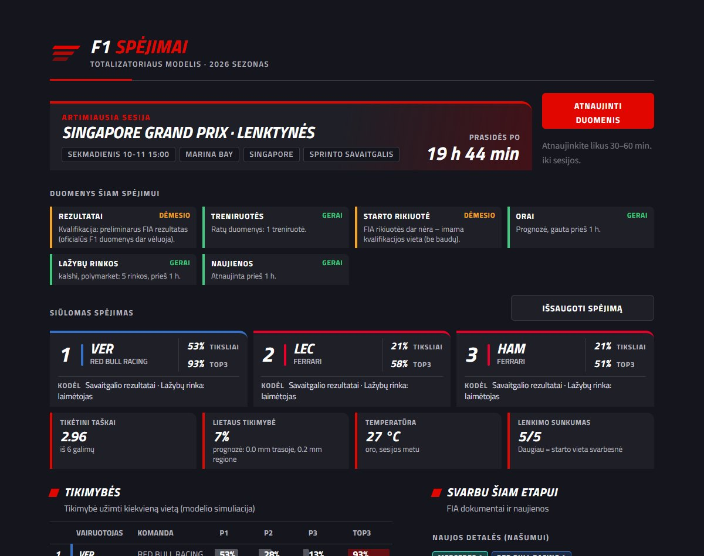

# F1 Spėjimai

Programa, padedanti spėti kiekvienos Formulės 1 sesijos (kvalifikacijos, sprinto, lenktynių) **TOP3**.
Ji sujungia oficialius F1 duomenis, treniruočių tempą, orų prognozę ir lažybų rinkų kainas, apskaičiuoja
kiekvieno vairuotojo tikimybes ir pasiūlo trejetą, kuris vidutiniškai surenka daugiausiai taškų
(2 tšk. – tiksli vieta, 1 tšk. – pateko į TOP3).

Sąsaja – lietuvių ir anglų kalbomis.



## Kaip įsidiegti (Windows 10/11)

1. Viršuje spauskite **Code → Download ZIP** ir išskleiskite (Extract All) archyvą bet kurioje vietoje.
2. Išskleistame aplanke dukart spustelėkite **`F1 Spėjimai.vbs`**.
3. Pirmą kartą programa pati įdiegs viską, ko reikia (Python, jei jo nėra, ir bibliotekas) – tai užtrunka
   2–5 minutes ir reikia interneto. Darbalaukyje atsiras nuoroda **„F1 Spejimai“**.
4. Programa atsidarys atskirame lange. Kairėje paspauskite **„Atnaujinti duomenis“**, kad gautumėte
   naujausius rezultatus, orus ir lažybų kainas.

Programa jau turi 2023–2026 m. duomenis, todėl veikia iškart. Visi jūsų duomenys saugomi aplanke `duomenys`
(sukuriamas pirmą kartą), niekur neišsiunčiami.

Išsami dokumentacija: [Dokumentacija.pdf](Dokumentacija.pdf).

### Kiti kompiuteriai (macOS / Linux)

Reikia Python 3.10 ar naujesnio:

```bash
cd programa
python3 -m venv .venv
.venv/bin/pip install -r requirements.txt
.venv/bin/streamlit run ui.py
```

## Struktūra

```
F1 Spėjimai.vbs          paleidimas (pirmą kartą – ir diegimas)
parametrai.json          keičiami modelio nustatymai
Dokumentacija.pdf        naudotojo ir techninė dokumentacija
programa/
├── idiegti.bat          diegimas (Python aplinka, bibliotekos, darbalaukio nuoroda)
├── ui.py, views/        sąsaja (Streamlit): įėjimas ir puslapiai
├── ui_style.py, ui.css  sąsajos išvaizda
├── cli.py               komandinė eilutė ir automatinis spėjimas prieš sesiją
├── f1model/             modelis, duomenų šaltiniai, duomenų bazė, vertimai
├── pradiniai_duomenys/  pradinė duomenų bazė naujam vartotojui
└── tests/               automatiniai testai (testai.bat)
```

Programuotojui – [programa/README.md](programa/README.md).

---

## English

**F1 Predictions** suggests the TOP3 for every Formula 1 session (qualifying, sprint, race). It combines
official F1 timing data, practice pace, weather forecasts and betting-market prices, simulates each session
and picks the trio with the most expected points. The interface is available in Lithuanian and English
(switch it in the left sidebar).

**Install on Windows:** *Code → Download ZIP*, extract it anywhere and double-click **`F1 Spėjimai.vbs`**.
On the first run it installs everything it needs (Python if missing, plus libraries; 2–5 minutes, internet
required) and adds a desktop shortcut. Then press **Update data** in the sidebar.

**macOS / Linux:** see the commands above (`python3 -m venv .venv`, `pip install -r requirements.txt`,
`streamlit run ui.py` in the `programa` folder).
